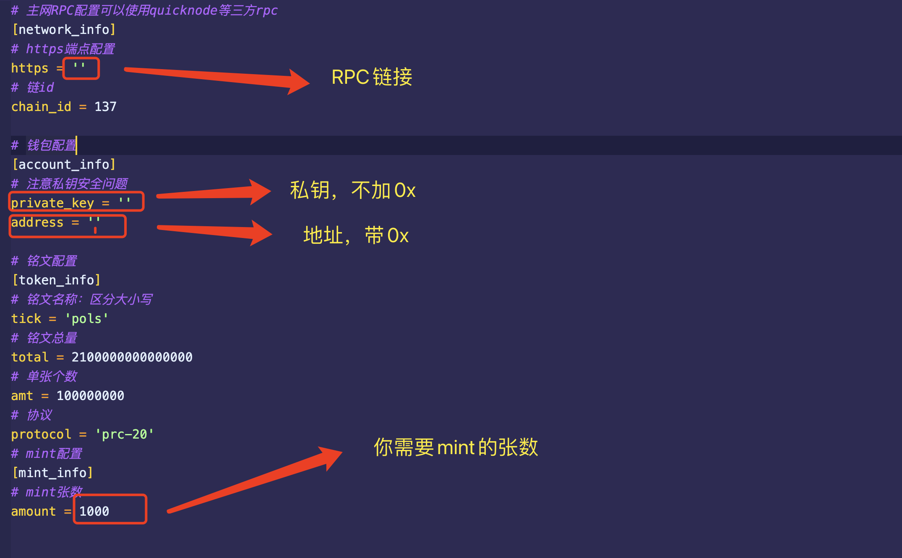

# 怎么运行?
## 1、本地安装rust环境
参考文章：  
https://learnblockchain.cn/article/5382  
或者自己找下相关文章

## 2、修改相关参数
修改src/config.conf下的配置文件


## 3、运行
### 1、方式一
将代码导入vscode，点击main.rs的run
### 2、方式二
命令行直接```cargo run RUST_BACKTRACE=1```


